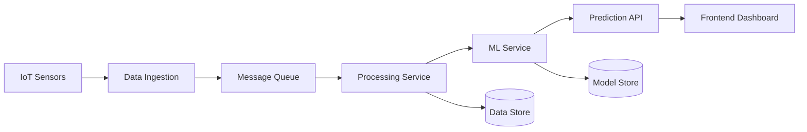

# AI-Driven Predictive Maintenance Platform

## Overview
An end-to-end cloud-native solution for real-time equipment failure prediction, combining AI/ML, DevOps automation, and big data processing. Built with industry-standard scalability and reliability patterns.

## System Architecture

### Core Components

1. **Frontend Application**
   - React-based SPA containerized with Docker
   - Material-UI for responsive dashboard components
   - Real-time data visualization using D3.js/Chart.js
   - WebSocket integration for live equipment metrics
   - Hosted in Nginx container

2. **Backend Services**
   - Node.js/Python microservices architecture
   - RESTful API endpoints with OpenAPI/Swagger documentation
   - gRPC for inter-service communication
   - JWT-based authentication
   - Containerized with Docker

3. **ML Pipeline (Optional Enhancement)**
   - Apache Kafka for real-time data streaming and ETL
   - Alternative cloud services:
     - AWS: Kinesis, SageMaker, EMR
     - Azure: Event Hubs, Azure ML, Databricks
   - Data preprocessing and feature engineering pipelines
   - Model training and validation workflows
   - Model serving infrastructure with:
     - Self-hosted: TensorFlow Serving, Seldon Core
     - Cloud-managed: SageMaker endpoints, Azure ML endpoints
   - A/B testing capabilities

4. **Data Layer**
   - PostgreSQL for transactional data
   - MongoDB for equipment metrics and sensor data
   - Redis for caching and real-time data
   - MinIO/S3 for model artifacts storage

5. **DevOps & Infrastructure**
   - Docker and Docker Compose for containerization
   - GitHub Actions for CI/CD pipelines
   - Infrastructure as Code using Terraform
   - Basic monitoring and logging setup

### System Flow



## Implementation Guidelines

### 1. Container Strategy
- Each service should have its own Dockerfile
- Multi-stage builds for optimized images
- Use of Docker Compose for local development and orchestration
- Container security scanning in CI/CD

### 2. CI/CD Pipeline Requirements
```yaml
stages:
  - lint
  - build
  - security-scan
  - deploy-staging
  - deploy-production
```

## Development Requirements

### Minimum Requirements
- Containerized services with Docker and Docker Compose
- Basic CI/CD pipeline with GitHub Actions
- Infrastructure management with Terraform
- REST API implementation
- Basic monitoring setup

### Advanced Features (Optional)
- ML Pipeline implementation
- A/B testing framework
- Advanced monitoring
- Auto-scaling implementation
- Chaos engineering tests

## Data Flow Architecture

### ML Pipeline (Optional)
1. Data Collection
   - Sensor data ingestion
   - Data validation
   - Raw data storage

2. Data Processing
   - Feature engineering
   - Data transformation
   - Training data preparation

3. Model Operations
   - Training pipeline
   - Model validation
   - Model deployment
   - Prediction serving

## Performance Considerations

- Target response time: <200ms for API endpoints
- System availability: 99.9%
- Data processing latency: <5s
- Model inference time: <100ms

## Security Requirements

1. Authentication & Authorization
   - JWT-based authentication
   - Role-based access control
   - API key management

2. Data Security
   - Encryption at rest
   - Encryption in transit
   - Data backup strategy

## Documentation Requirements

- API documentation (OpenAPI/Swagger)
- Deployment guides
- Architecture diagrams
- Troubleshooting guides
- Development setup instructions

## Success Criteria

- Successful deployment of containerized services
- Functional CI/CD pipeline
- API endpoint availability
- Basic monitoring and alerting
- Documentation completeness

## Collaboration and Teamwork

### Team Structure
- Teams of maximum six members
- Clearly defined roles and responsibilities
- Regular progress reporting
- Scheduled instructor check-ins

### Team Responsibilities
- Task assignment and tracking
- Code review processes
- Documentation maintenance
- Progress reporting
- Team communication protocols

## Mentorship and Support

### Instructor Support
- Regular check-ins and progress reviews
- Technical guidance and problem-solving
- Architecture and design review
- Best practices consultation

### Support Resources
- Office hours availability
- Technical documentation
- Code examples and templates
- Troubleshooting guides

## Reflection and Self-Assessment

### Individual Growth
- Technical skill development tracking
- Challenge identification and resolution
- Learning objectives achievement
- Contribution assessment

### Team Assessment
- Project milestone completion
- Collaboration effectiveness
- Communication efficiency
- Knowledge sharing practices

### Documentation Requirements
- Weekly progress reports
- Individual contribution logs
- Team retrospective documents
- Project completion reflection

## Project Submission

### Repository Structure
```
final-project/
├── code/
│   ├── frontend/
│   ├── backend/
│   ├── ml-pipeline/
│   └── infrastructure/
├── documentation/
│   ├── setup-guide.md
│   ├── api-docs/
│   ├── architecture/
│   └── deployment-guide.md
├── presentations/
│   ├── final-presentation.pdf
│   └── demo-video.mp4
└── reports/
    ├── weekly-updates/
    ├── team-retrospectives/
    └── final-report.md
```

### Submission Requirements

1. **Repository Setup**
   - Fork the main project repository
   - Follow the provided directory structure
   - Maintain clean commit history
   - Include comprehensive README.md

2. **Code Implementation**
   - Well-organized source code
   - Clear commenting and documentation
   - Consistent coding style
   - Implementation of required features
   - Docker configuration files
   - Infrastructure as Code files

3. **Documentation**
   - System architecture documentation
   - API documentation
   - Setup and installation guides
   - Deployment procedures
   - Troubleshooting guides
   - Infrastructure diagrams

4. **Final Report**
   - Project overview
   - Technical implementation details
   - Challenges and solutions
   - Team member contributions
   - Lessons learned
   - Future improvements

5. **Final Presentation**
   - Project demonstration
   - Architecture overview
   - Technical decisions explanation
   - Lessons learned
   - Q&A session

### Quality Guidelines

1. **Code Quality**
   - Clean and readable code
   - Proper error handling
   - Consistent formatting
   - Modular design
   - Best practices implementation

2. **Documentation Quality**
   - Clear and concise writing
   - Up-to-date information
   - Proper formatting
   - Complete coverage of features
   - Included examples

3. **Repository Organization**
   - Logical file structure
   - Clear naming conventions
   - Proper use of .gitignore
   - Well-organized branches
   - Meaningful commit messages

### Submission Process

1. **Repository Preparation**
   - Ensure all code is committed
   - Update documentation
   - Verify all links work
   - Check for sensitive information
   - Test deployment scripts

2. **Final Checks**
   - Repository is public
   - All dependencies are documented
   - README is complete
   - Documentation is up-to-date
   - Required files are present

3. **Submission Steps**
   - Submit repository URL
   - Provide access to any deployed instances
   - Schedule final presentation
   - Submit final report
   - Complete team assessment

### Evaluation Criteria

- Project completeness
- Code quality and organization
- Documentation thoroughness
- Implementation of required features
- Team collaboration
- Presentation quality
- Innovation and creativity
- Problem-solving approach
